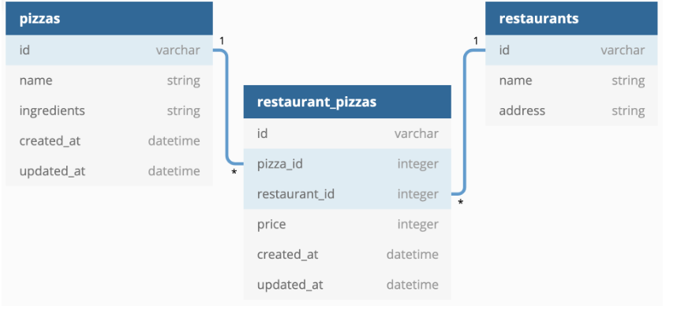

# phase4-wk1-code challenge FLASK PIZZA RESTAURANTS
For this assessment, you'll be working with a pizza restaurant domain.Your job is to build out the Flask API to add the functionality described in the deliverable below.
Test your endpoints as stated below.
Running the Flask serverand using Postman to make requests.
You need to create the following relationships:
A Restaurant has many Pizzas through Restaurantpizza
A pizza has many Restaurants through RestaurantPizza
A RestaurantPizza belongs to a Restaurant and belongs to a Pizza.

## Technologies Used
flask = "==2.2.2"
flask-sqlalchemy = "==3.0.2"
flask-migrate = "==2.7.0"
flask-script = "===2.0.5"
## Installation
1. clone the repo
2. Navigate to the projects directory
3. Install all the required dependencies.The root directory of this repository contains the Pipfile with all the required Python libraries for this project and restricts them to this repository.

To install the required libraries, run: pipenv install
4. Enter the pipenv shell
5. Set up the server by running python manage.py runserver
To populate the database run the command python seed.py
